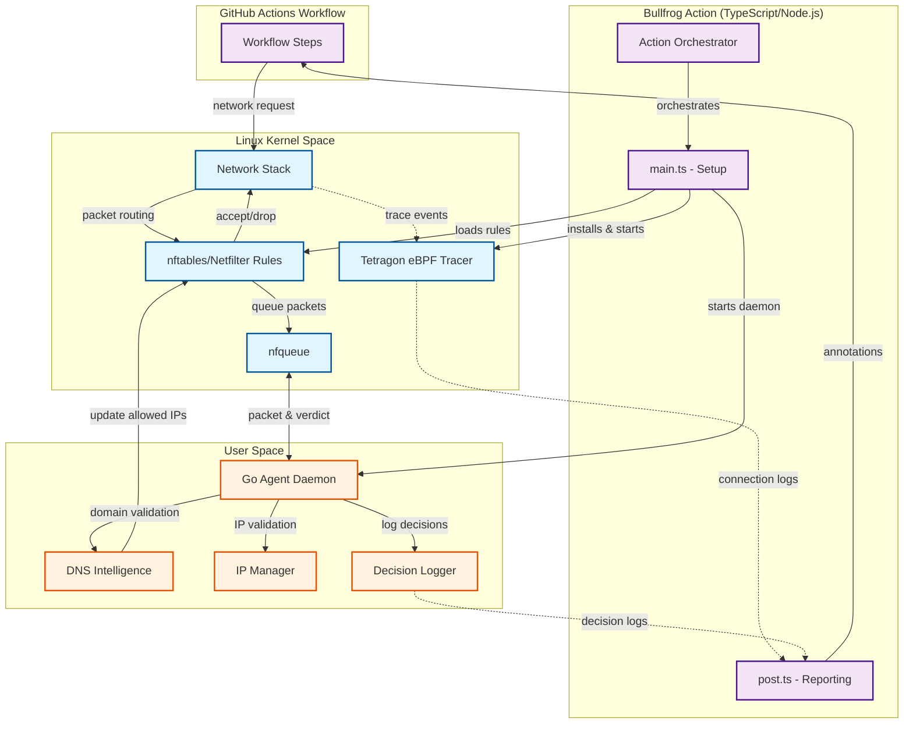
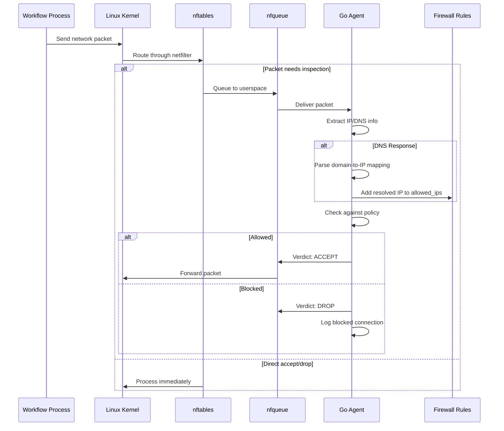

# Bullfrog

Increase the security of your Github Actions workflows using Bullfrog! With Bullfrog, you can easily control all your outbound network connections made from within your Github Actions workflows by defining a list of IPs and/or domains that you want to allow.

Not sure what IPs or domains? Simply use the default `egress-policy: audit` mode to get a list of all outbound network connections, without impacting your existing workflows.

## Usage

<!-- start usage -->

```yaml
# This action should be the first step of your job, and should be loaded on every separate job.
# If this action is not loaded first, it will not be able to see or block any requests that occured prior to the action running.
- uses: bullfrogsec/bullfrog@1831f79cce8ad602eef14d2163873f27081ebfb3 # v0.8.4
  with:
    # List of IPs to allow outbound connections to.
    # By default, only localhost and IPs required for the essential operations of Github Actions are allowed.
    allowed-ips:

    # List of domains to allow outbound connections to.
    # Wildcards are accepted. For example, if allowing `*.google.com`, this will allow `www.google.com`, `console.cloud.google.com` but not `google.com`.
    # By default, only domains required for essential operations of Github Actions and uploading job summaries are allowed.
    # Refer to https://docs.github.com/en/actions/using-github-hosted-runners/about-github-hosted-runners/about-github-hosted-runners#communication-requirements-for-github-hosted-runners-and-github for additional domains that should be allowed for additional Github Actions features.
    allowed-domains:

    # Controls the policy for DNS requests when `egress-policy` is set to `block`.
    #
    #  - `allowed-domains-only` (default): Allows DNS requests only for domains specified in `allowed-domains`.
    #  - `any`: Allows any DNS requests.
    #
    # Default: `allowed-domains-only`
    dns-policy:

    # The egress policy to enforce. Valid values are `audit` and `block`.
    # Default: audit
    egress-policy:

    # Enable this option to allow steps to execute commands with sudo.
    # This is useful for workflows that require elevated privileges to perform certain tasks.
    # Options: `true` (default) or `false`.
    enable-sudo:
```

<!-- end usage -->

## Scenarios

- [Default](#default)
- [Block every outbound connections](#block-every-outbound-connections)
- [Only allow requests to domains required for pulling a docker image from the docker hub](#only-allow-requests-to-domains-required-for-pulling-a-docker-image-from-the-docker-hub)
- [Only allow requests to a specific IP address without blocking DNS requests](#only-allow-requests-to-a-specific-ip-address-without-blocking-dns-requests)

### Default

The default usage will run in audit mode and will not block any request.

```yaml
- uses: bullfrogsec/bullfrog@1831f79cce8ad602eef14d2163873f27081ebfb3 # v0.8.4
```

### Block every outbound connections

```yaml
- uses: bullfrogsec/bullfrog@1831f79cce8ad602eef14d2163873f27081ebfb3 # v0.8.4
  with:
    egress-policy: block
```

### Only allow requests to domains required for pulling a docker image from the docker hub

```yaml
- uses: bullfrogsec/bullfrog@1831f79cce8ad602eef14d2163873f27081ebfb3 # v0.8.4
  with:
    egress-policy: block
    allowed-domains: |
      *.docker.com
      docker.io
      *.docker.io
```

### Only allow requests to a specific IP address without blocking DNS requests

```yaml
- uses: bullfrogsec/bullfrog@1831f79cce8ad602eef14d2163873f27081ebfb3 # v0.8.4
  with:
    egress-policy: block
    allowed-ips: |
      1.2.3.4
    dns-policy: any
```

## Architecture

Bullfrog is a three-layer security system that provides real-time egress filtering for GitHub Actions workflows. It combines Linux kernel networking capabilities with a userspace decision engine to monitor and control all outbound network connections.

### System Components



### How It Works

**1. Initialization Phase**

When Bullfrog runs as the first step of your workflow, the GitHub Action orchestrator:

- Installs system dependencies (`nftables`, `libnetfilter-queue`)
- Deploys and starts Tetragon (eBPF-based network event tracer)
- Downloads and verifies the Go agent binary
- Loads netfilter rules appropriate to your policy mode
- Starts the Go agent daemon with your configuration

**2. Runtime Packet Flow**

During workflow execution, all outbound network packets follow this path:



**3. Netfilter Rules**

Bullfrog uses Linux nftables to implement egress filtering with three distinct rule configurations:

- **Audit Mode** (`queue_audit.nft`): Queues only DNS responses for inspection. All traffic flows normally while decisions are logged for review.

- **Block Mode** (`queue_block.nft`): Sets output chain policy to DROP by default. Only connections to IPs in the `allowed_ips` set are permitted. DNS responses are queued for dynamic IP allowlisting.

- **Secure Block Mode** (`queue_block_with_dns.nft`): Strictest mode that queues both DNS queries and responses. Enforces domain allowlisting and prevents DNS exfiltration.

**4. Go Agent Responsibilities**

The Go agent (`/opt/bullfrog/agent`) runs as a userspace daemon and handles:

- **Packet Processing**: Receives queued packets from the kernel via netfilter queue, parses protocol layers (IP, TCP/UDP, DNS), and returns ACCEPT/DROP verdicts.

- **DNS Intelligence**: Intercepts DNS responses to extract domain-to-IP mappings. When an allowed domain resolves to an IP address, that IP is dynamically added to the firewall's `allowed_ips` set, enabling connections to the resolved address.

- **Domain Matching**: Validates domains against the allowlist using wildcard pattern matching (e.g., `*.docker.com` matches `registry-1.docker.com`).

- **IP Management**: Maintains separate maps for exact IP matches and CIDR ranges. Updates netfilter's `allowed_ips` element set in real-time.

- **Security Controls**: Validates DNS servers (only trusts system-configured DNS), prevents DNS over TCP exfiltration, and can disable sudo to prevent raw socket usage.

- **Decision Logging**: Writes all allow/block decisions to `/var/log/gha-agent/decisions.log` in the format: `timestamp|decision|domain|destination_ip`.

**5. Post-Action Reporting**

After the workflow completes, the post-action phase:

- Collects decision logs from the Go agent
- Collects connection trace events from Tetragon
- Correlates data by IP address and timestamp
- Generates workflow annotations for blocked or unallowed connections
- Displays results in the workflow summary

### Example: Allowing Docker Hub

When you configure:

```yaml
allowed-domains: |
  *.docker.io
```

The flow works as follows:

1. Your workflow process attempts to resolve `registry-1.docker.io`
2. The Go agent intercepts the DNS query, matches it against `*.docker.io`, and allows it
3. DNS returns IP address `54.198.135.21`
4. The agent intercepts the DNS response and adds `54.198.135.21` to the firewall's `allowed_ips` set
5. Your workflow connects to `54.198.135.21:443`
6. nftables checks the IP against `allowed_ips`, finds a match, and accepts the packet
7. Connection succeeds and the decision is logged

This dynamic allowlisting enables domain-based policies while supporting services with dynamic IP addresses.

## Reviewing blocked or unallowed outbound requests

You can view blocked or unallowed outbound requests in the workflow summary.


## Limitations

- This action is currently only supporting Github-hosted runners on Ubuntu (`ubuntu-latest`, `ubuntu-22.04` and `ubuntu-24.04`).
- Jobs running in [containers](https://docs.github.com/en/actions/writing-workflows/choosing-where-your-workflow-runs/running-jobs-in-a-container) are not supported.
- Packets sent using the raw IP layer will bypass the agent responsible for the egress filtering. For this reason, we highly recommend using the `enable-sudo: false` to prevent usage of the raw IP layer.

## Support or Feedback

If you need support or have any feedback to share, join us on [Slack](https://join.slack.com/t/bullfogsec/shared_invite/zt-2mbf603gn-TRfhXvf_x8J7yB9fJ3Os7Q). And if you find Bullfrog useful, please leave a star ⭐️.

## License

The code and documentation in this project are released under the [MIT License](LICENSE).
