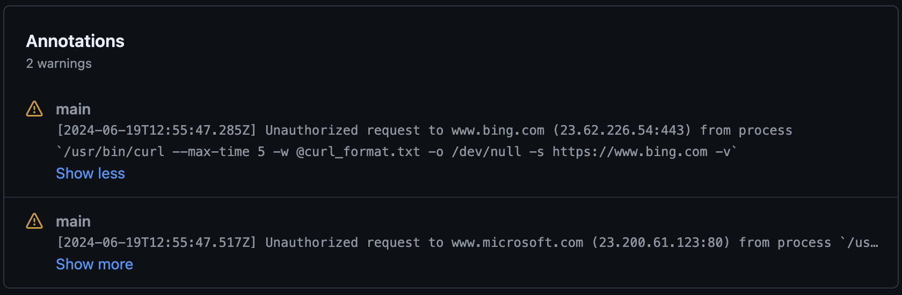

# Bullfrog

Increase the security of your Github Actions workflows using Bullfrog! With Bullfrog, you can easily control all your outbound network connections made from within your Github Actions workflows by defining a list of IPs and/or domains that you want to allow.

Not sure what IPs or domains? Simply use the default `egress-policy: audit` mode to get a list of all outbound network connections, without impacting your existing workflows.

This should not trigger a full build

## Usage

<!-- start usage -->

```yaml
# This action should be the first step of your job, and should be loaded on every separate job.
# If this action is not loaded first, it will not be able to see or block any requests that occured prior to the action running.
- uses: bullfrogsec/bullfrog@37cbe3f08b15d9595789d51874dd7468fef1b8d9 # v0.6.1
  with:
    # List of IPs to allow outbound connections to.
    # By default, only localhost and IPs required for the essential operations of Github Actions are allowed.
    allowed-ips:

    # List of domains to allow outbound connections to.
    # Wildcards are accepted. For example, if allowing `*.google.com`, this will allow `www.google.com`, `console.cloud.google.com` but not `google.com`.
    # By default, only domains required for essential operations of Github Actions and uploading job summaries are allowed.
    # Refer to https://docs.github.com/en/actions/using-github-hosted-runners/about-github-hosted-runners/about-github-hosted-runners#communication-requirements-for-github-hosted-runners-and-github for additional domains that should be allowed for additional Github Actions features.
    allowed-domains:

    # Controls the policy for DNS requests when `egress-policy` is set to `block`.
    #
    #  - `allowed-domains-only` (default): Allows DNS requests only for domains specified in `allowed-domains`.
    #  - `any`: Allows any DNS requests.
    #
    # Default: `allowed-domains-only`
    dns-policy:

    # The egress policy to enforce. Valid values are `audit` and `block`.
    # Default: audit
    egress-policy:
```

<!-- end usage -->

## Scenarios

- [Default](#Default)
- [Block every outbound connections](#Block-every-outbound-connections)
- [Only allow requests to domains required for pulling a docker image from the docker hub](#Only-allow-requests-to-domains-required-for-pulling-a-docker-image-from-the-docker-hub)
- [Only allow requests to a specific IP address without blocking DNS requests](#Only-allow-requests-to-a-specific-IP-address-without-blocking-DNS-requests)

### Default

The default usage will run in audit mode and will not block any request.

```yaml
- uses: bullfrogsec/bullfrog@37cbe3f08b15d9595789d51874dd7468fef1b8d9 # v0.6.1
```

### Block every outbound connections

```yaml
- uses: bullfrogsec/bullfrog@37cbe3f08b15d9595789d51874dd7468fef1b8d9 # v0.6.1
  with:
    egress-policy: block
```

### Only allow requests to domains required for pulling a docker image from the docker hub

```yaml
- uses: bullfrogsec/bullfrog@37cbe3f08b15d9595789d51874dd7468fef1b8d9 # v0.6.1
  with:
    egress-policy: block
    allowed-domains: |
      *.docker.com
      docker.io
      *.docker.io
```

### Only allow requests to a specific IP address without blocking DNS requests

```yaml
- uses: bullfrogsec/bullfrog@37cbe3f08b15d9595789d51874dd7468fef1b8d9 # v0.6.1
  with:
    egress-policy: block
    allowed-ips: |
      1.2.3.4
    dns-policy: any
```

## Reviewing blocked or unallowed outbound requests

You can view blocked or unallowed outbound requests in the workflow summary.


## Runners compability

This action is currently only supporting Github-hosted runners on Ubuntu (`ubuntu-latest`, `ubuntu-22.04` and `ubuntu-24.04`).

## License

The code and documentation in this project are released under the [MIT License](LICENSE).
